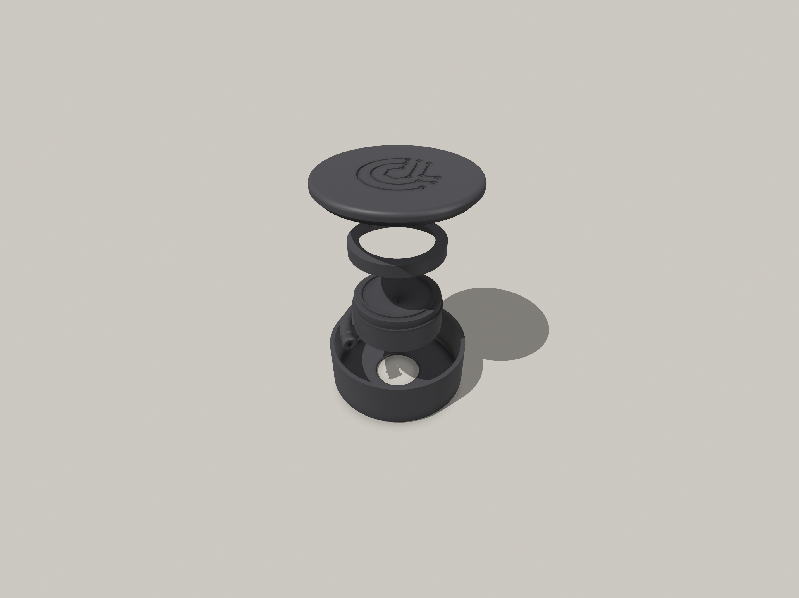
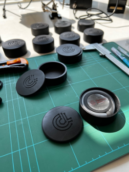

# Glia stethoscope | Pocket Version

The Glia stethoscope as a pocket-sized giveaway

## About

This is a pocket version of the Glia stethoscope [1].

It's fully functional, however not meant for a clinical use, but as a giveaway.

## Authors

Developed, tested and built at the OpenLab MedTec [2] by

- OStGefr d.R Foxley
- OStGefr Westphal

## Contributing

Please feel free to make, copy, modify or redistribute our work. You want to reach out to us directly, get in touch with us via Matrix:

https://matrix.to/#/#openlab-medtec:vow.chat

## Licensing

**As the original is licensed under TAPR OHL [3], this remix is too. GPLv3 down there is just a placeholder; the actual license is TAPR OHL!**

--

[1] https://github.com/GliaX/Stethoscope  
[2] https://openlab.hamburg/en/openlabs/medtec/  
[3] https://tapr.org/the-tapr-open-hardware-license/
