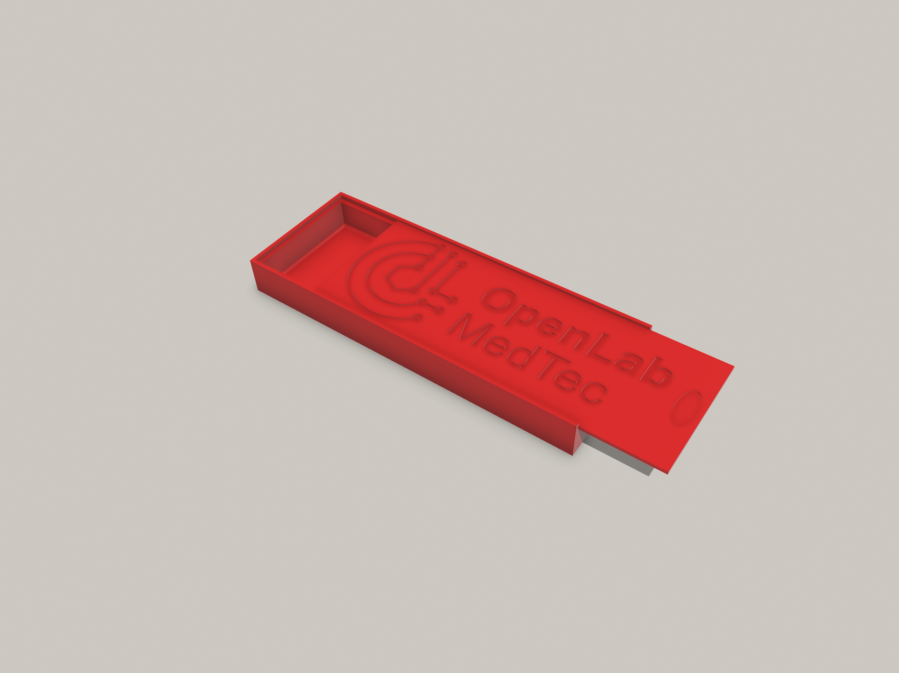
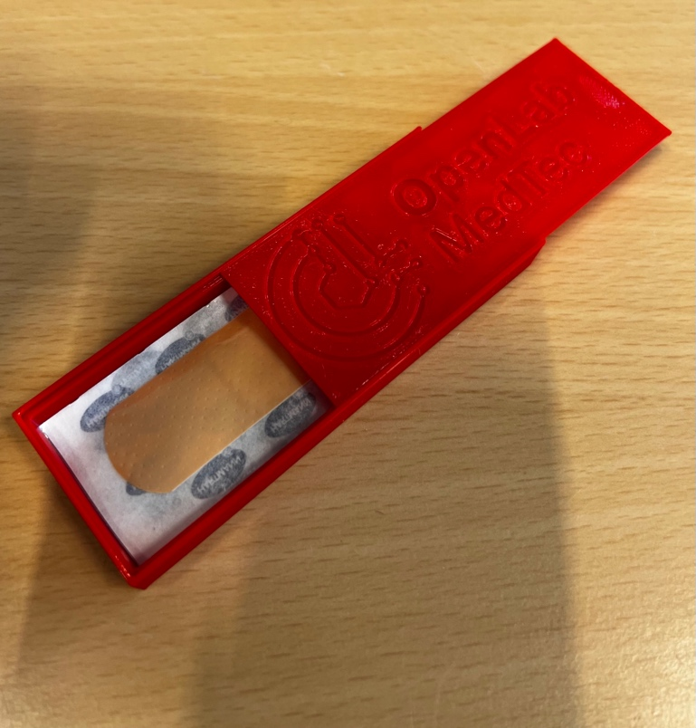

# OpenLab Plaster Box

plaster box with OpenLab branding

## About

Plaster box with minimal material use and yet sufficient stability.

Also works as a giveaway :)

## Authors

Developed, tested and built at the OpenLab MedTec [1] by

- Apotheke BwKrhs Hamburg
- OStGefr d.R. Foxley
- OStGefr Westphal

## Contributing

Please feel free to make, copy, modify or redistribute our work. You want to reach out to us directly, get in touch with us via Matrix:

https://matrix.to/#/#openlab-medtec:vow.chat

--

[1] https://openlab.hamburg/en/openlabs/medtec/
