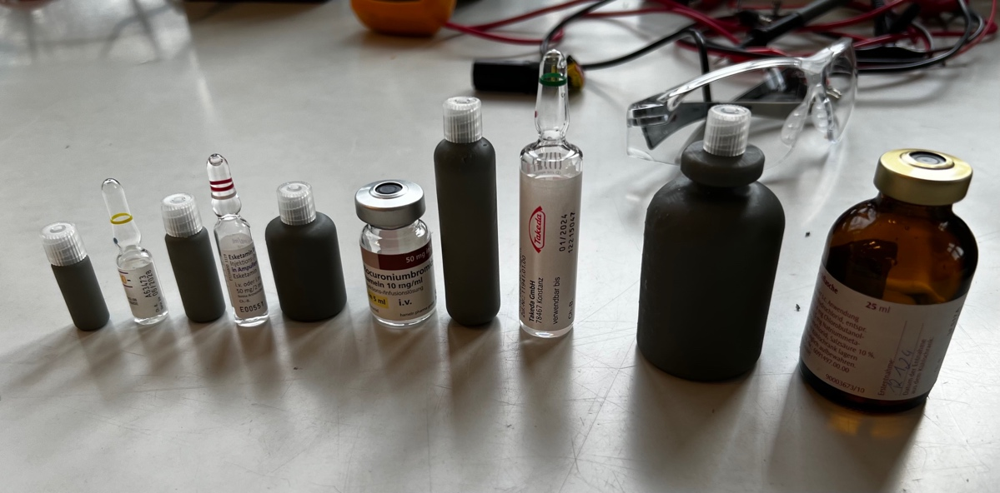
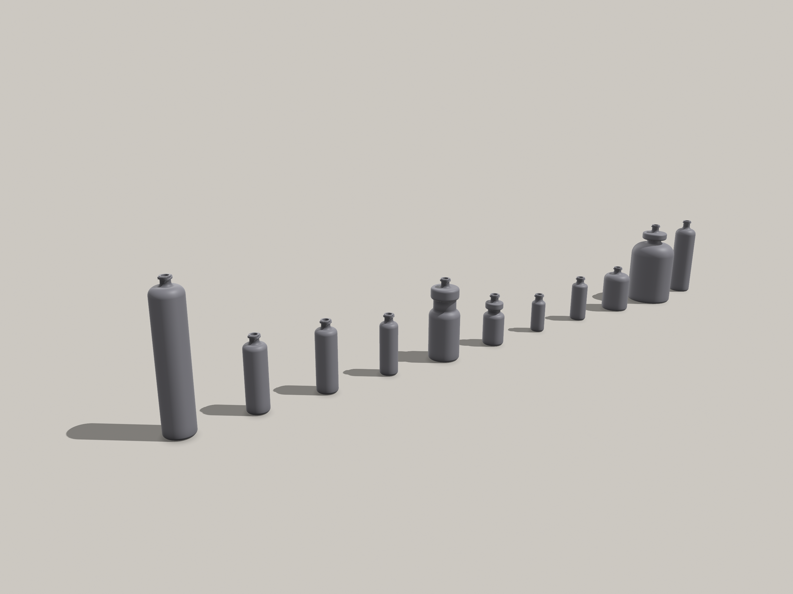

# Training Ampoules and Vials (luer-lock)

Ampoules and vails with luer-lock fitting for medical training (1…25ml)

## About

Printable ampoules with luer-lock fitting (ISO 80369-1) for training purposes.

Different variants available, according to their real-world counter-parts:

- Ampoules
  - 1ml
  - 2ml
  - 3ml
  - 4ml
  - 5ml
  - 10ml
  - 20ml
- Vails
  - 2ml
  - 5ml
  - 10ml
  - 25ml

Printed with `Anycubic Basic Grey` on a `Prusa Medical ONE` SLA 3D Printer.

## Authors

Developed, tested and built at the OpenLab MedTec [1] by

- FltlArzt Dr. Bräunig
- Lt SanOA Engelke
- OStGefr Westphal

## Contributing

Please feel free to make, copy, modify or redistribute our work. You want to reach out to us directly, get in touch with us via Matrix:

https://matrix.to/#/#openlab-medtec:vow.chat

--

[1] https://openlab.hamburg/en/openlabs/medtec/
